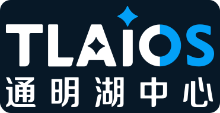
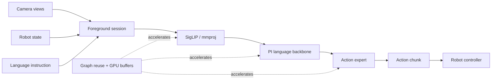

<div align="center">
  <p>
    <a href="https://www.pku.edu.cn/"></a>
    &nbsp;&nbsp;&nbsp;&nbsp;&nbsp;&nbsp;
    <a href="https://www.tlaic.ac.cn/"></a>
  </p>

  

  <p><strong>A llama.cpp-based inference engine for real-time onboard Vision-Language-Action control.</strong></p>
  <p>Run VLA locally on NVIDIA Jetson, desktop GPUs, CPUs, NPUs, and other edge platforms through a persistent robot-facing HTTP runtime.</p>

  <p>
    <a href="https://arxiv.org/abs/2607.12659"></a>
    <a href="https://github.com/PKU-SEC-Lab/Jetson-PI"></a>
    <a href="https://github.com/ggml-org/llama.cpp"></a>
    <a href="https://github.com/flashrt-project/FlashRT"></a>
  </p>

  <p>
    <a href="#real-world-demo">Demo</a> ·
    <a href="#quick-start">Quick Start</a> ·
    <a href="#performance-on-jetson-orin">Performance</a> ·
    <a href="docs/model_conversion.md">Model Conversion</a> ·
    <a href="docs/foreground_server_usage.md">Server API</a> ·
    <a href="#citation">Citation</a>
  </p>
</div>

---

## News

- **[2026/07] FlashRT support is available.** Jetson-PI is exposed as a FlashRT-loadable provider through a C API, allowing [FlashRT](https://github.com/flashrt-project/FlashRT) to invoke the same PI0/PI0.5 model path directly from Python without starting the foreground HTTP server.
- **[2026/07] Jetson-PI is open source.** We released the [Jetson-PI asynchronous control framework](https://github.com/PKU-SEC-Lab/Jetson-PI) and this [Jetson-PI-Edge inference engine](https://github.com/PKU-SEC-Lab/Jetson-PI-Edge).

## About

Jetson-PI-Edge is the inference engine accompanying our paper:

> **[Jetson-PI: Towards Onboard Real-Time Robot Control via Foresight-Aligned Asynchronous Inference](https://arxiv.org/abs/2607.12659)**<br>
> Zebin Yang, Qi Wang, Yunhe Wang, Xiurui Guo, Bo Yu, Shaoshan Liu, Jiafeng Xu, Hao Dong, and Meng Li.<br>
> arXiv:2607.12659, 2026.

Deploying VLA policies on low-power onboard hardware is difficult because model latency directly limits control frequency and responsiveness. Jetson-PI combines foresight-aligned asynchronous correction with confidence-aware scheduling and system-level acceleration. This repository provides the llama.cpp-based execution layer: GGUF model loading, multimodal encoding, PI action-expert inference, graph reuse, and a persistent foreground server for robot control loops.

The project is built on [llama.cpp](https://github.com/ggml-org/llama.cpp). The asynchronous control algorithm lives in [PKU-SEC-Lab/Jetson-PI](https://github.com/PKU-SEC-Lab/Jetson-PI).

## Real-World Demo

<p align="center">
  
</p>

<p align="center">
  <a href="video/demo.mp4">▶ Watch the full-resolution demo (MP4)</a>
</p>

## Current Support and Roadmap

### Supported Models

- ✅ **PI0** - PI-specific multimodal preprocessing, language backbone, action expert, and continuous action-chunk generation.
- ✅ **PI0.5** - two-view prefix construction, PI0.5 prompt/state handling, and 10-step action generation.
- ✅ **Automatic model dispatch** - detect PI0 and PI0.5 from GGUF metadata and model tensor names, with an explicit `PI_MODEL` override.

### Runtime Optimizations

- ✅ **Graph reuse** - reuse the ViT, language backbone, and action-expert computation graphs across inference rounds.
- ✅ **GPU-resident intermediate buffers** - keep reusable embeddings and cross-KV intermediates on the accelerator to reduce host/device traffic.
- ✅ **Flow unrolling** - execute multiple action-expert flow steps in one graph to reduce scheduling and launch overhead.

### Interfaces and Deployment

- ✅ **Foreground HTTP server** - persistent image, robot-state, and instruction endpoints with action and timing outputs.
- ✅ **FlashRT provider** - expose the same PI0/PI0.5 GGUF runtime through a C API for the FlashRT Python model interface.

### Planned Model Support

#### Vision-Language-Action Models

- [ ] [NVIDIA Isaac GR00T N1.7](https://github.com/NVIDIA/Isaac-GR00T) - open reasoning VLA for generalist and humanoid robot control.
- [ ] [LingBot-VLA 2.0](https://github.com/Robbyant/lingbot-vla-v2) - cross-embodiment VLA covering manipulators and humanoid robots.
- [ ] [Qwen-RobotManip](https://qwen.ai/blog?id=qwen-robotmanip) - Qwen-based manipulation VLA with representation, motion, and behavior alignment.

#### World-Action and World-Model-Driven Models

- [ ] [DreamZero](https://github.com/dreamzero0/dreamzero) - world-action model that jointly predicts future video and robot actions.
- [ ] [FastWAM](https://github.com/yuantianyuan01/FastWAM) - real-time WAM that uses video co-training while skipping future imagination at inference time.

## Runtime Architecture



The server keeps the foreground session alive across requests. A control process uploads sensor observations, calls inference once, and consumes a flat action tensor plus detailed latency fields. This avoids rebuilding the model interface for every control step.

## Quick Start

### 1. Build the server

CPU-only:

```bash
cmake -S . -B build -DCMAKE_BUILD_TYPE=Release
cmake --build build --target llama-server -j
```

NVIDIA Jetson or another CUDA-capable target:

```bash
cmake -S . -B build -DGGML_CUDA=ON -DCMAKE_BUILD_TYPE=Release
cmake --build build --target llama-server -j
```

### 2. Prepare the model

The runtime expects two matching files:

- a PI language/action model in GGUF format;
- a SigLIP vision encoder/projector in GGUF format.

Follow [Model Preparation](docs/model_conversion.md) to download, split, and convert a PI0 or PI0.5 checkpoint.

### 3. Start the foreground server

```bash
PI_MODEL=auto \
./build/bin/llama-server \
  -m /path/to/pi_llm.gguf \
  --mmproj /path/to/mmproj.gguf \
  -ngl 99 \
  --host 0.0.0.0 \
  --port 8080
```

Use `PI_MODEL=pi0` or `PI_MODEL=pi05` to force a model path. For reproducible numerical comparisons, set `PI0_ACTION_NOISE_BIN` to a fixed binary noise tensor.

### 4. Run one inference round

Reset the persistent session:

```bash
curl -X POST http://127.0.0.1:8080/foreground/reset
```

Submit two camera views:

```bash
curl -X POST http://127.0.0.1:8080/foreground/image \
  -H 'Content-Type: application/json' \
  -d '{"path":"/path/to/image_1.png"}'

curl -X POST http://127.0.0.1:8080/foreground/image \
  -H 'Content-Type: application/json' \
  -d '{"path":"/path/to/image_2.png"}'
```

Submit the robot state:

```bash
curl -X PUT http://127.0.0.1:8080/foreground/state \
  -H 'Content-Type: application/json' \
  -d '{"state":"1.8731,-1.0370,1.9652,7.0876,0.2546,-9.1432,-0.0147,-0.5037,0,0,0,0,0,0,0,0,0,0,0,0,0,0,0,0,0,0,0,0,0,0,0,0"}'
```

Request an action chunk:

```bash
curl -X POST http://127.0.0.1:8080/foreground/infer \
  -H 'Content-Type: application/json' \
  -d '{"text":"pick up the object and place it into the tray"}'
```

The response contains `action_final` together with model and server timing fields such as `encode_ms`, `decode_ms`, `total_ms`, and `timing_breakdown_ms`. See the [Foreground Server API](docs/foreground_server_usage.md) for endpoint semantics and all response fields.

## FlashRT Support

Jetson-PI can be loaded by [FlashRT](https://github.com/flashrt-project/FlashRT) through a C API provider. The provider reuses the same llama.cpp-based PI0/PI0.5 implementation and GGUF model path from this repository, while FlashRT supplies the Python-facing model API. The foreground HTTP server is not required for this integration.

After installing FlashRT, configure its C++ build with this repository as the Jetson-PI source tree:

```bash
cmake -S /path/to/FlashRT/cpp -B /path/to/FlashRT/cpp/build-jetson-pi \
  -DCMAKE_BUILD_TYPE=Release \
  -DFLASHRT_CPP_WITH_JETSON_PI=ON \
  -DJETSON_PI_ROOT=/path/to/Jetson-PI-Edge \
  -DGGML_CUDA=ON \
  -DGGML_CUDA_FA=ON \
  -DCMAKE_CUDA_ARCHITECTURES=<target-sm>

cmake --build /path/to/FlashRT/cpp/build-jetson-pi \
  --target flashrt_cpp_llama_cpp_provider_c -j
```

The build produces `libflashrt_cpp_llama_cpp_provider_c.so`. Load it from Python with `framework="jetson_pi"`:

```python
import os

import flash_rt
import numpy as np
from PIL import Image


def load_rgb224(path):
    image = Image.open(path).convert("RGB")
    if image.size != (224, 224):
        image = image.resize((224, 224), Image.BILINEAR)
    return np.asarray(image, dtype=np.uint8)


os.environ["PI0_ACTION_NOISE_BIN"] = "/path/to/pi0_noise_10x32.bin"

model = flash_rt.load_model(
    "/path/to/pi_llm.gguf",
    framework="jetson_pi",
    config="pi0",
    mmproj_path="/path/to/mmproj.gguf",
    backend="cuda",
    num_views=2,
    action_steps=10,
    action_dim=32,
    # Usually produced at:
    # <FlashRT repo>/cpp/<build-dir>/libflashrt_cpp_llama_cpp_provider_c.so
    lib_path="/path/to/FlashRT/cpp/build-jetson-pi/libflashrt_cpp_llama_cpp_provider_c.so",
)

image = load_rgb224("/path/to/image.png")
images = [image, image]

state = np.asarray([
    -1.8731, -1.0370, 1.9652, 7.0876, 0.2546, -9.1432, -0.0147, -0.5037,
    0, 0, 0, 0, 0, 0, 0, 0, 0, 0, 0, 0, 0, 0, 0, 0,
    0, 0, 0, 0, 0, 0, 0, 0,
], dtype=np.float32)

prompt = "do something"
actions = model.predict(images=images, prompt=prompt, state=state)

np.savetxt("actions_10x32.txt", np.asarray(actions, dtype=np.float32), fmt="%.9g")
```

See the [FlashRT repository](https://github.com/flashrt-project/FlashRT) for installation and its complete API. The standalone llama.cpp foreground server remains available independently and does not require FlashRT.


## Performance on Jetson Orin

Latency is measured in milliseconds on NVIDIA Jetson Orin in MAXN mode. See the paper for the complete experimental setup and end-to-end control results.

### PI0

| Runtime configuration | ViT | LLM | Action Expert | Total |
|---|---:|---:|---:|---:|
| Naive PI0 | 143.5 | 601.9 | 505.5 | 1250.9 |
| + Schedule optimization | 147.1 | 603.1 | 501.3 | 1251.5 |
| + Graph reuse | 76.8 | 200.6 | 167.0 | 444.4 |
| + Intermediate buffer and unroll | **75.4** | **200.3** | **118.8** | **394.5** |

### PI0.5

| Runtime configuration | ViT | LLM | Action Expert | Total |
|---|---:|---:|---:|---:|
| Naive PI0.5 | 152.3 | 631.0 | 536.8 | 1420.8 |
| + Schedule optimization | 152.3 | 631.0 | 536.8 | 1420.8 |
| + Graph reuse | 79.5 | 212.6 | 184.0 | 476.1 |
| + Intermediate buffer and unroll | **79.5** | **210.3** | **123.1** | **412.9** |


## Documentation

| Document | Description |
|---|---|
| [Model Preparation](docs/model_conversion.md) | Download, split, and convert PI checkpoints to GGUF. |
| [Foreground Server API](docs/foreground_server_usage.md) | Session lifecycle, endpoints, response fields, and operational notes. |
| [ViT Optimization](latency_optimize_docs/pi0_vit_optimization.md) | Vision graph reuse and input-layout optimization. |
| [Decode Graph Reuse](latency_optimize_docs/pi0_decode_graph_reuse.md) | Action-expert graph reuse implementation. |
| [GPU KV Cache](latency_optimize_docs/pi0_decode_kv_gpu.md) | GPU-resident cross-KV cache design. |

## Citation

If Jetson-PI or Jetson-PI-Edge helps your research, please cite our paper:

```bibtex
@misc{yang2026jetsonpi,
  title         = {Jetson-PI: Towards Onboard Real-Time Robot Control via Foresight-Aligned Asynchronous Inference},
  author        = {Zebin Yang and Qi Wang and Yunhe Wang and Xiurui Guo and Bo Yu and Shaoshan Liu and Jiafeng Xu and Hao Dong and Meng Li},
  year          = {2026},
  eprint        = {2607.12659},
  archivePrefix = {arXiv},
  primaryClass  = {cs.RO},
  url           = {https://arxiv.org/abs/2607.12659}
}
```

## Acknowledgments

Jetson-PI-Edge builds on [llama.cpp](https://github.com/ggml-org/llama.cpp), [OpenPI](https://github.com/Physical-Intelligence/openpi), and the PI model family from [Physical Intelligence](https://www.physicalintelligence.company/). We also thank the [FlashRT](https://github.com/flashrt-project/FlashRT) project for its high-performance real-time VLA deployment path.
